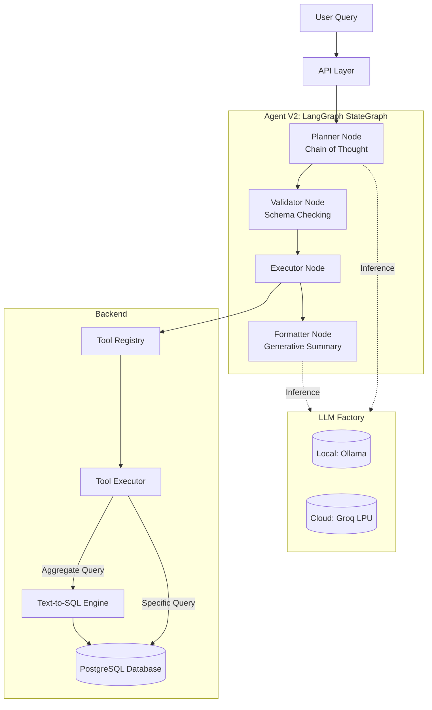

# Architecture Notes

## Current Validated Architecture

## Core Technologies
- **LangGraph**: Stateful flow orchestrator (`StateGraph`).
- **LangChain & Groq**: `langchain-groq` for lightning-fast LPU cloud inference (`llama-3.1-8b-instant`).
- **PostgreSQL / SQLAlchemy**: Database layer cleanly abstracted from tools.

## V5 Project-Grade Evaluation Framework
The architecture now relies on an enterprise-grade 5-Layer testing suite:
1. **Deterministic Intent Classification**: Regex routing via `INTENT_PATTERNS`.
2. **Intent-Specific Extraction**: Targeting only relevant numbers (e.g. `REQUIRED_FIELDS = {"variance": ["variance"]}`).
3. **Deterministic Finance Validation**: `math.isclose()` applied with strict numeric bounds.
4. **Business Logic Validation**: Immediate `CRITICAL` severity failures for sign-reversals or "not applicable" contradictions.
5. **Decoupled Semantic Validation**: LLM judge determines conceptual clarity independent of numeric scoring.

### Strict Golden Dataset (Anti-Tautology Architecture)
We discovered that if an LLM is used to generate the ground-truth dataset, and then the same LLM is evaluated against it, it creates an **Evaluation Tautology** (grading its own homework). To solve this, `scripts/generate_golden_dataset.py` completely bypasses the LLM for 68% of the queries. It uses deterministic Regex to extract subsystem IDs, directly calls Python PostgreSQL functions (`finance_service.py`), and injects the raw math into hardcoded templates (`response_formatter.py`). This guarantees a mathematically pure dataset, completely immune to LLM hallucination.

## Persistence & Config Layer
- `.env` -> `app/core/settings.py` -> Configures `LLM_PROVIDER="groq"` or `"ollama"`.
- PostgreSQL seeded automatically via `app/core/seed_database.py`.

## Current Safeguards
- Planner output must pass JSON validation before tool execution.
- LLM Factory strictly enforces `GROQ_API_KEY` checking before instantiation, falling back to cached instances.
- V5 regex extractors proactively strip `subsystem \d+` from LLM text before searching for financial totals, effectively preventing ID matching hallucinations.
